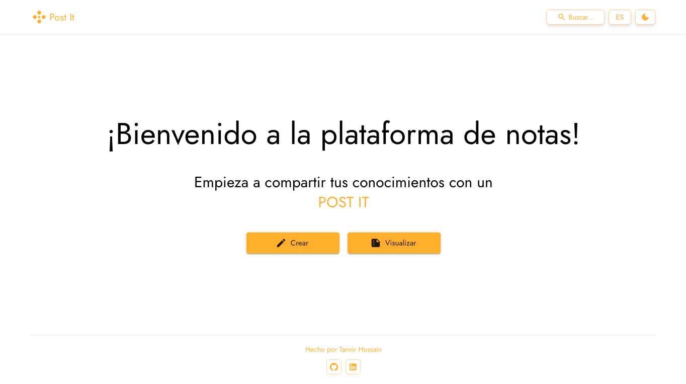

<a href="https://post-your-ideas.netlify.app" target="_blank">
  
  <h1 align="center">🚀 Post It</h1>
</a>

Write down your ideas in a document editor and publish them to share your knowledge.

  
  

  
  

 

  <a href="./doc/abstract.md#🎯-overview"><strong>Overview</strong></a> ·
  <a href="./doc/abstract.md#📚-project-management"><strong>Project management</strong></a> ·
  <a href="./doc/abstract.md#⚙️-tech-stack"><strong>Technologies</strong></a> ·
  <a href="./doc/abstract.md#📝-license"><strong>License</strong></a>

